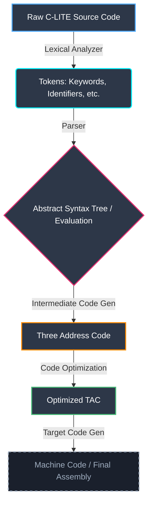

# 🚀 C-LITE Compiler

<div align="center">
  <a href="https://huggingface.co/spaces/adityasahani001/c-lite-compiler" target="_blank">
    
  </a>
  <br><br>
  
  
  
  
</div>

<br>

**C-LITE Compiler** is a fully functional mini-compiler project written in C, wrapped in a beautiful, interactive web interface using Python and Gradio. This project is designed to help students and developers understand the internal mechanics of how programming languages are compiled, step by step.

---

## 🌟 Features

* **Complete Compiler Pipeline**: Implements the fundamental phases of a compiler.
* **Lexical Analyzer (Scanner)**: Breaks raw source code down into recognizable tokens.
* **Parser (Syntax Analyzer)**: Evaluates mathematical expressions using recursive descent parsing.
* **Three Address Code (TAC)**: Generates intermediate language representations of syntax trees.
* **TAC Optimizer**: Detects and optimizes identical redundant expressions in TAC format.
* **Interactive Web UI**: A stunning, premium dark-mode interface built with Gradio.
* **Cross-Platform & Portable**: Automatically compiles its own C dependencies using GCC on startup.

---

## 🛠️ Compiler Flow Architecture

This compiler operates in a multi-stage pipeline. The UI allows you to interact with each stage independently:


*(Note: Target Code Generation is currently beyond the scope of this mini-compiler project.)*

---

## 📂 Project Structure

```text
C_lite/
│── src/
│   ├── LA.c                   # Lexical Analyzer implementation
│   ├── parser.c               # Syntax checking and evaluation
│   ├── module4_TAC.c          # Three Address Code generator
│   ├── module5_optimizer.c    # Code Optimizer logic
│
│── app.py                     # The Gradio Web Application wrapper
│── requirements.txt           # Python dependencies
│── README.md                  # Project Documentation
│── LICENSE                    # License information
```

---

## 🚀 Getting Started

### Prerequisites

To run the interactive UI on your local machine, ensure you have the following installed:
1. **Python 3.8+**
2. **GCC Compiler** (MinGW for Windows, or native `gcc` on Linux/macOS)

### Installation & Launch

1. **Clone the repository** (or navigate to your local folder):
   ```bash
   cd "C lite"
   ```

2. **Install the Python requirements**:
   ```bash
   pip install -r requirements.txt
   ```

3. **Start the Application**:
   ```bash
   python app.py
   ```
   *The application will automatically invoke `gcc` to compile the C programs inside the `src/` folder if they aren't already built. The web server will start at `http://127.0.0.1:7860`.*

---

## ☁️ Hugging Face Deployment

🚀 **This project is officially live!** You can try the interactive compiler UI right now without installing anything by visiting my Hugging Face Space:  
👉 **[Live C-LITE Compiler Demo](https://huggingface.co/spaces/adityasahani001/c-lite-compiler)**

If you want to deploy your own customized version, follow these steps: 

1. Create a new Space on [Hugging Face](https://huggingface.co/spaces).
2. Choose **Gradio** as your Space SDK.
3. Upload the `app.py`, `requirements.txt`, and the entire `src/` directory.
4. The Hugging Face Linux container will automatically download Gradio, compile the C code using its native GCC, and host your compiler UI live on the internet!

---

## 👨‍💻 Author

**Aditya Sahani**  
*B.Tech CSE (AI/ML), IILM University*

⭐ *Feel free to explore, fork, and improve this educational project!*
